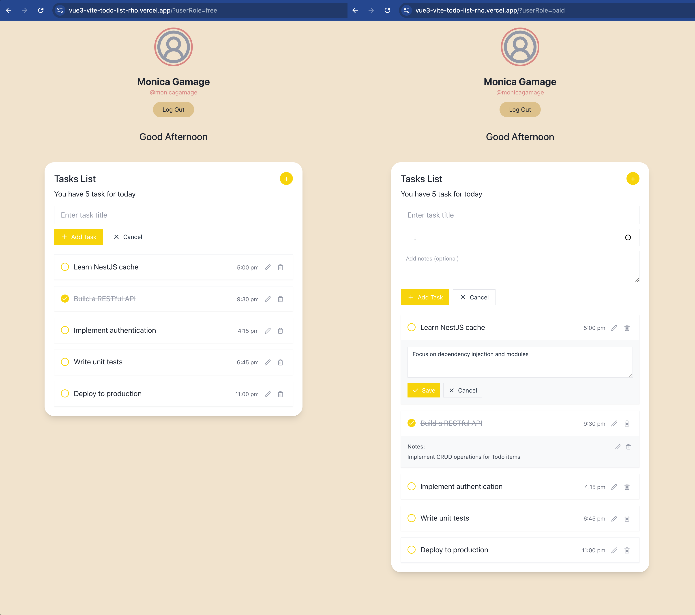

# To-Do-List

<div align="center">

</div>

## 🏁 Getting Started <a name="getting-started"></a>

> This is a list of needed instructions to set up your project locally, to get a local copy up and running follow these
> instructions.

### Prerequisite <a name="prerequisite"></a>

1. Node.js

### Installation <a name="installation"></a>

1. **_Clone the repository_**

```sh
$ git clone https://github.com/PhamQuangSon/vue3-vite-todo-list.git
```

2. **_Navigate to TodoList Folder_**

```sh
$ cd vue3-vite-todo-list
```

## Project Setup

```sh
npm install
```

### Compile and Hot-Reload for Development

```sh
npm run dev
```

### Type-Check, Compile and Minify for Production

```sh
npm run build
```

### Lint with [ESLint](https://eslint.org/)

```sh
npm run lint
```

## 💻 Built Using <a name="built-using"></a>

- **Vue 3**
- **Vite**

### Demo Links

- [Free User Demo](https://vue3-vite-todo-list-rho.vercel.app/?userRole=free)
- [Paid User Demo](https://vue3-vite-todo-list-rho.vercel.app/?userRole=paid)

## 📸 Demo Screens <a name="demo-screens"></a>

<div align="center">

</div>

## Recommended IDE Setup

[VSCode](https://code.visualstudio.com/) + [Volar](https://marketplace.visualstudio.com/items?itemName=Vue.volar) (and disable Vetur) + [TypeScript Vue Plugin (Volar)](https://marketplace.visualstudio.com/items?itemName=Vue.vscode-typescript-vue-plugin).

## Type Support for `.vue` Imports in TS

TypeScript cannot handle type information for `.vue` imports by default, so we replace the `tsc` CLI with `vue-tsc` for type checking. In editors, we need [TypeScript Vue Plugin (Volar)](https://marketplace.visualstudio.com/items?itemName=Vue.vscode-typescript-vue-plugin) to make the TypeScript language service aware of `.vue` types.

If the standalone TypeScript plugin doesn't feel fast enough to you, Volar has also implemented a [Take Over Mode](https://github.com/johnsoncodehk/volar/discussions/471#discussioncomment-1361669) that is more performant. You can enable it by the following steps:

1. Disable the built-in TypeScript Extension
    1) Run `Extensions: Show Built-in Extensions` from VSCode's command palette
    2) Find `TypeScript and JavaScript Language Features`, right click and select `Disable (Workspace)`
2. Reload the VSCode window by running `Developer: Reload Window` from the command palette.

## Customize configuration

See [Vite Configuration Reference](https://vitejs.dev/config/).